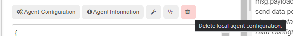
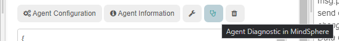

# node-red-contrib-mindconnect

## Node-RED Agent for the MindConnect API

<!-- markdownlint-disable MD033 -->

<!-- markdownlint-enableMD033 -->

This node enables the Node-RED users to upload timeseries, files and events to MindSphere.
This project has started as a community effort at Siemens AG and is now available for general use.

[](https://github.com/mindsphere/node-red-contrib-mindconnect/actions/workflows/build.yml) [](./LICENSE.md)
[](https://www.npmjs.com/package/@mindconnect/node-red-contrib-mindconnect) 
[](https://lgtm.com/projects/g/mindsphere/node-red-contrib-mindconnect/alerts/)
[](https://lgtm.com/projects/g/mindsphere/node-red-contrib-mindconnect/context:javascript)
[](https://opensource.mindsphere.io/docs/node-red-contrib-mindconnect/index.html)
[](https://community.plm.automation.siemens.com/t5/Developer-Space/bd-p/MindSphere-platform-forum)
[](https://playground.mindconnect.rocks)

The node is written in typescript/javascript without any native dependencies so it should work beside x86 also on other platforms (e.g. on raspberry pi, IoT2000 etc, you just have to have Node-RED installed).

## Installing the node

```bash
# change to your ~./node-red/ folder
cd ~/.node-red/
npm install @mindconnect/node-red-contrib-mindconnect
```

## Node-RED - Manage Palette Installation

You can install the node also via the Manage palette feature in the Node-RED administration UI.


### FAQ

- install to the .node-red folder if you have installed node-red globally
- install to the userDir directory if you have custom userDir
- make sure that your nodejs version is relatively current

## How to use the Node-RED node

Since version 3.9.0 it is possible to completely configure the agent from Node-RED. You will only need the initial Boarding configuration from the MindSphere UI.

### Step 0: Create (at least) one asset and one agent in MindSphere

- Create an asset in Asset Manager for your data
- Create an agent of the type MindConnectLib [core.mclib] and store the agent.

### Step 1: Get the initial agent configuration from Mindsphere Asset Manager

You can choose between:

- **RSA_3072** public/private key pair (3072bit) for enhanced security which requires more computing power on the devices and
- **SHARED_SECRET** shared key (256bit) for lightweight devices.

If you want to use RSA_3072 you will have to create a 3072bit key for your device, eg. with openssl:

```bash
openssl genrsa -out private.key 3072
```

There is no additional configuration required for SHARED_SECRET security profile.


### Step 2: Copy the agent onboarding information (and if necessary the RSA 3072 private key) to the node and deploy the flow

Copy the agent onboarding information and optionally the RSA_3072 private key to the node and deploy the flow.


### Step 3: Press the agent configuration button and select the target asset

The most common agent configuration setup is to have a 1:1 mapping between the Node-RED agent which is delivering the data and your target
MindSphere Asset. If this type of configuration is sufficient for your use case you just have to click on the asset to which you want to map the data in the asset list. (you can use the filter asset listbox to quickly find your asset)


The node will automatically configure all necessary data sources and mapping for you. If you need a more complex setup, just click on the **MindSphere Configuration Dialog** button which will lead you to the configuration dialog in the MindSphere, where you can create more complex configurations and mappings.


### Step 4: Create and deploy the flow and send data

You can use the node to send timeseries, bulk timeseries, events and files to MindSphere. The templates for the input messages are listed
below, but you can also just use the **Agent Information** button which will let you copy the corresponding template to clipboard.


#### Send data points

The node requires json objects as input in following format (e.g. from a function node)

```javascript
const values = [
    { dataPointId: "1000000000", qualityCode: "1", value: "42" },
    { dataPointId: "1000000001", qualityCode: "1", value: "33.7" },
    { dataPointId: "1000000003", qualityCode: "1", value: "45.76" }
];

msg._time = new Date();
msg.payload = values;
return msg;
```

The node will validate if the data is valid for your agent configuration. his feature can be switched off in the settings but it is not recommended to do so.

#### Send data points in bulk

The node requires json objects as input in following format (e.g. from a function node if you want to use bulk upload)

```javascript
const values = [
    {
        timestamp: "2018-11-09T07:46:36.699Z",
        values: [
            { dataPointId: "1000000000", qualityCode: "1", value: "42" },
            { dataPointId: "1000000001", qualityCode: "1", value: "33.7" },
            { dataPointId: "1000000003", qualityCode: "1", value: "45.76" }
        ]
    },
    {
        timestamp: "2018-11-08T07:46:36.699Z",
        values: [
            { dataPointId: "1000000000", qualityCode: "1", value: "12" },
            { dataPointId: "1000000001", qualityCode: "1", value: "13.7" },
            { dataPointId: "1000000003", qualityCode: "1", value: "15.76" }
        ]
    }
];

msg.payload = values;
return msg;
```

**Note:** All MindSphere timestamps must be in the **ISO format** (use `toISOString()` function).

#### Send events

The node requires json objects as input in following format (e.g. from a function node). You can send an event to any asset you have access to in your tenant. Just use the asset id in the entityid.

```javascript
msg.payload = {
    entityId: "d72262e71ea0470eb9f880176b888938", // optional, use assetid if you want to send event somewhere else :)
    sourceType: "Agent",
    sourceId: "application",
    source: "Meowz",
    severity: 30, // 0-99 : 20:error, 30:warning, 40: information
    description: "Event sent at " + new Date().toISOString(),
    timestamp: new Date().toISOString(),
    additionalproperty1: "123",
    additionalproperty2: "456"
};
return msg;
```

If you are using the custom events instead of MindSphere Standard Events please include the following switch in the message.

```javascript
msg._customEvent=true;
```

#### File Upload

The node requires json objects as input in following format (e.g. from a function node). You can upload file to any asset you have access to in your tenant. Just use the asset id in the entityid.

```javascript
msg.payload = {
    entityId: "d72262e71ea0470eb9f880176b888938", //optional (per default files are uploaded to the agent)
    fileName: "digitaltwin.png", // you can also pass an instance of a Buffer
    fileType: "image/png", //optional, it is automatically determined if there is no fileType specified
    filePath: "images/digitaltwin.png", // required if you are using buffer instead of the file name
    description: "testfile"
};
return msg;
```

If the experimental chunking feature is on, the files which are larger than 8MB will be uploaded in 8 MB Chunks.

#### Data Lake File Upload

Precondition for data lake upload is that [MindSphere Integrated Data Lake](https://www.dex.siemens.com/mindsphere/applications/integrated-data-lake) is purchased and write-enabled.
The node requires json objects as input in following format (e.g. from a function node).

```javascript
// take a look at the flow examples at https://playground.mindconnect.rocks 
//
// Preconditions : data-lake is purchased and enabled for writing (see mc data-lake --mode write  CLI command)
//
// Agents can only upload files to a path which is prefixed with their agent id
// The MindConnect Node will apply this prefix automatically to the dataLakeFileUpload Path
// You can pass either a javascript buffer or path to file in the dataLakeFile property for upload
// The subTenantId can be optionally added to the messsage

const dataLakeFileInfo = {
  "dataLakeFile": "my/path/to/file.txt",
  "dataLakeFilePath": "uploads/file.txt"
};

// Uncomment the next code line if you just want to generate an upload url (in msg._signedUrl) 
// without actually uploading the file
// msg._ignorePayload = true;

msg.payload = dataLakeFileInfo;
return msg;
```

Please note:

- Agents can only upload files to a path which is prefixed with their agent id
- The MindConnect Node will apply this prefix automatically to the dataLakeFileUpload Path
- You can pass either a javascript buffer or path to file in the dataLakeFile property for upload
- The subTenantId can be optionally added to the messsage

#### Reading Asset Information

You can read the data (e.g. static asset variables, or full asset information) from MindSphere using the following message. This can be used to implement a "digital shadow/digital twin" pattern, where the change in the MindSphere variables is reflected to the real world asset. See [bidirectional communication example flow](https://playground.mindconnect.rocks/#flow/9ff72be.3d502d8) on playground for a full example.

```javascript
msg.payload = {
  "assetId": "{assetId}",
  "includeShared": false,
  "propertyNames": []
};

return msg;
```

You can reduce the number of items in payload by specifying list of properties to include in the message: e.g.
`propertyNames: ["variables"] or ["location"]`

#### Executing custom functions using MindSphere javascript/typescript SDK

The node can be used to execute a complex script which uses [MindSphere javascript/typescript SDK](https://opensource.mindsphere.io/docs/mindconnect-nodejs/sdk/index.html). The node will create an asyncronous function with one parameter (sdk) and the specified function body and execute it. You can only call the MindSphere APIs which allow agent authorization.

```javascript
msg.payload = {
    function: `
const assetManagement = sdk.GetAssetManagementClient();
const asset = await assetManagement.GetAsset('{assetId}');
return asset;
`};
           
return msg;
```

#### Error handling in the flows

The node can be configured to retry all mindsphere operations (1-10 times, with delay of time \* 300ms before the next try)
If you need more complex flows, the node also returns the

```javascript
msg._mindsphereStatus; // OK on success othervise error
msg._error; // The timestamped error message
```

properties which can be used to create more complex flows. (e.g. in the flow below, the unrecoverable errors are written in error.log file and the failed data is stored in backupdata.log file)


## JWT Token Generation for SouthBound APIs

The node can be used to generate authentication tokens which you can use to call your own custom southbound APIs.
The msg.headers will have a Mindsphere Authorization JWT.

```javascript
msg._includeMindSphereToken=true;
```

if you just want to get the token without sending any data to MindSphere

```javascript
msg._ignorePayload=true;
```

Treat tokens as you would any other credentials.

## Control Topic and Status Messages

The version 3.11.0 introduces two new features - the status message which is displayed on the node (and/or emited on the `control` topic dependent on the Emit Control topic) after either:

- the maximal number of parallel requests (**Async Requests**) has been exceeded or
- the maximal wait time (**Async Duration**) has been reached.

The following image illustrates the function of the new settings:


The `payload` on the `control` topic with the status information looks like this:

```javascript
{
    requests: number;
    success: number;
    pending: number;
    errors: number;
}
```

This information can be used to manage for example a queue node before the mindconnect node to regulate the flow of
the messages. See example `#HighDataVolume` on [https://playground.mindconnect.rocks](https://playground.mindconnect.rocks)

## Demo flows

[](https://playground.mindconnect.rocks)

[MindConnect Node-RED playground](https://playground.mindconnect.rocks) provides following demo flows importing following data points to MindSphere

- CPU-Usage
- Batched MQTT Data
- OPC-UA Data
- Real Weather Data to MindSphere
- Simulated Water Pump Data
- Custom SouthBound API Calls

The simulated water pump data can be inspected at

<https://dreamforce.mindconnect.rocks>

This application can be used without mindsphere credentials.

- username: guest@mindsphere.io
- password: Siemens123!

This data is also used as an example for the KPI-Calculation and Trend prediction with help of MindSphere APIs. <https://github.com/mindsphere/analytics-examples>

## Securing API Endpoints

The corresponding API calls for reading the data source configuration and mappings in Agent Configuration and Agent Information dialog require that the user has:

```mindconnect.read```

permission. The automatic configuration requires

```mindconnect.write```

permission.

## Troubleshooting

If you have problems with your agent:

1. Stop the agent.
2. Move or delete the content of the .mc folder (the json files with configuration and authentication settings).
3. Offboard the agent.
4. Create new settings for the mindconnect library.
5. copy the new settings to the node.

### Reseting the agent settings from version 3.7.0

Since version 3.7.0. it is possible to delete the content of the .mc/agentconfig.json file and the agent settings directly from the node.

Press on the "delete local configuration" :wastebucket: button on the node, confirm the dialog and redeploy the node.



If you are having problems, it is a good idea to restart the Node-RED runtime completely.

### Diagnostic in MindSphere

If the data is not arriving in your configured asset you should take a look if the data is beeing dropped in MindSphere because of a misconfiguration.
The agent diagnostic button will lead you directly to the agent diagnostic application in the MindSphere.



## Generating the documentation

You can always generate the current HTML documentation by running the command below.

```bash
#this generates a docs/ folder the with full documentation of the library.
npm run doc
```

## Proxy support

Set the http_proxy or HTTP_PROXY environment variable if you need to connect via proxy.

```bash
# set http proxy environment variable if you are using e.g. fiddler on the localhost.

export HTTP_PROXY=http://localhost:8888
```

## How to setup development environment

```bash
# create a directory ../devnodes
cd ..
mkdir devnodes
cd devnodes
# this registers your development directory with node red
npm link ../node-red-contrib-mindconnect

# after that in you can start developing with
cd ../node-red-contrib-mindconnect

npm run start-dev

# your node red flows will be stored in the ../devnodes directory
```

## Legal

This project has been released under an [Open Source license](./LICENSE.md). The release may include and/or use APIs to Siemens’ or third parties’ products or services. In no event shall the project’s Open Source license grant any rights in or to these APIs, products or services that would alter, expand, be inconsistent with, or supersede any terms of separate license agreements applicable to those APIs. “API” means application programming interfaces and their specifications and implementing code that allows other software to communicate with or call on Siemens’ or third parties’ products or services and may be made available through Siemens’ or third parties’ products, documentations or otherwise.
