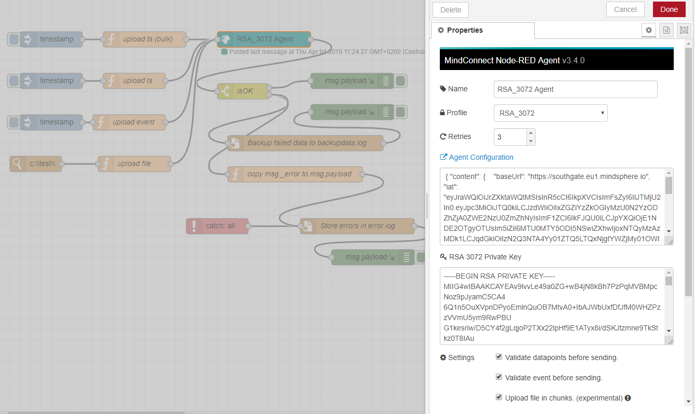

# node-red-contrib-mindconnect

## Node-RED Agent for the MindConnect API


This node enables the Node-RED users to upload timeseries, files and events to MindSphere.
This project has started as a community effort at Siemens AG and is now available for general use.

[](https://jenkins.mindconnect.rocks/blue/organizations/jenkins/node-red-contrib-mindconnect/activity/) [](./LICENSE.md)
[](https://www.npmjs.com/package/@mindconnect/node-red-contrib-mindconnect) 
[](https://snyk.io/test/github/mindsphere/node-red-contrib-mindconnect?targetFile=package.json)
[](https://lgtm.com/projects/g/mindsphere/node-red-contrib-mindconnect/alerts/)
[](https://lgtm.com/projects/g/mindsphere/node-red-contrib-mindconnect/context:javascript) [](https://greenkeeper.io/)

The node is written in typescript/javascript without any native dependencies so it should work beside x86 also on other platforms (e.g. on raspberry pi, IoT2000 etc, you just have to have Node-RED installed).

## Installing the node

```bash
# change to your ~./node-red/ folder
cd ~/.node-red/
npm install @mindconnect/node-red-contrib-mindconnect
```

### FAQ

- install to the .node-red folder if you have installed node-red globally
- install to the userDir directory if you have custom userDir
- make sure that your nodejs version is relatively current

## How to use the Node-RED node

### Step 1: Create (at least) one asset, agent, configuration and mappings

- Create an asset in Asset Manager for your data
- Create an agent of the type MindConnectLib [core.mclib] and store the agent.
- Create a new data configuration


- Create mappings to your asset.


### Step 2: Get the initial agent configuration from Mindsphere Asset Manager

You can choose between:

- **RSA_3072** public/private key pair (3072bit) for enhanced security which requires more computing power on the devices and
- **SHARED_SECRET** shared key (256bit) for lightweight devices.

If you want to use RSA_3072 you will have to create a 3072bit key for your device, eg. with openssl:

```bash
openssl genrsa -out private.key 3072
```

There is no additional configuration required for SHARED_SECRET security profile.

### Step 3: Copy the agent configuration (and if necessary the private key to the node)



### Step 4: Create and deploy the flow

#### Send data points

The node requires json objects as input in following format (e.g. from a function node)

```javascript
const values = [
    { dataPointId: "1000000000", qualityCode: "1", value: "42" },
    { dataPointId: "1000000001", qualityCode: "1", value: "33.7" },
    { dataPointId: "1000000003", qualityCode: "1", value: "45.76" }
];

msg._time = new Date();
msg.payload = values;
return msg;
```

The node will validate if the data is valid for your agent configuration. his feature can be switched off in the settings but it is not recommended to do so.

#### Send data points in bulk

The node requires json objects as input in following format (e.g. from a function node if you want to use bulk upload)

```javascript
const values = [
    {
        timestamp: "2018-11-09T07:46:36.699Z",
        values: [
            { dataPointId: "1000000000", qualityCode: "1", value: "42" },
            { dataPointId: "1000000001", qualityCode: "1", value: "33.7" },
            { dataPointId: "1000000003", qualityCode: "1", value: "45.76" }
        ]
    },
    {
        timestamp: "2018-11-08T07:46:36.699Z",
        values: [
            { dataPointId: "1000000000", qualityCode: "1", value: "12" },
            { dataPointId: "1000000001", qualityCode: "1", value: "13.7" },
            { dataPointId: "1000000003", qualityCode: "1", value: "15.76" }
        ]
    }
];

msg.payload = values;
return msg;
```

#### Send events

The node requires json objects as input in following format (e.g. from a function node). You can send an event to any asset you have access to in your tenant. Just use the asset id in the entityid.

```javascript
msg.payload = {
    entityId: "d72262e71ea0470eb9f880176b888938", // optional, use assetid if you want to send event somewhere else :)
    sourceType: "Agent",
    sourceId: "application",
    source: "Meowz",
    severity: 30, // 0-99 : 20:error, 30:warning, 40: information
    description: "Event sent at " + new Date().toISOString(),
    timestamp: new Date().toISOString(),
    additionalproperty1: "123",
    additionalproperty2: "456"
};
return msg;
```

The node will per default validate if the event is valid for your agent configuration. This feature can be switched off in the settings but it
is not recommended to do so.

#### File Upload

The node requires json objects as input in following format (e.g. from a function node). You can upload file to any asset you have access to in your tenant. Just use the asset id in the entityid.

```javascript
msg.payload = {
    entityId: "d72262e71ea0470eb9f880176b888938", //optional (per default files are uploaded to the agent)
    fileName: "digitaltwin.png", // you can also pass an instance of a Buffer
    fileType: "image/png", //optional, it is automatically determined if there is no fileType specified
    filePath: "images/digitaltwin.png", // required if you are using buffer instead of the file name
    description: "testfile"
};
return msg;
```

If the experimental chunking feature is on, the files which are bigger then 8MB will be uploaded in 8 MB Chunks.

#### Error handling in the flows

The node can be configured to retry all mindsphere operations (1-10 times, with delay of time \* 300ms before the next try)
If you need more complex flows, the node also returns the

```javascript
msg._mindsphereStatus; // OK on success othervise error
msg_error // The timestamped error message
```

properties which can be used to create more complex flows. (e.g. in the flow below, the unrecoverable errors are written in error.log file and the failed data is stored in backupdata.log file)


## How to reset everything

If you have problems with your agent:

1. Stop the agent.
2. Move or delete the content of the .mc folder (the json files with configuration and authentication settings).
3. Offboard the agent.
4. Create new settings for the mindconnect library.
5. copy the new settings to the node.

## Generating the documentation

You can always generate the current HTML documentation by running the command below.

```bash
#this generates a docs/ folder the with full documentation of the library.
npm run doc
```

## Proxy support

Set the http_proxy or HTTP_PROXY environment variable if you need to connect via proxy.

```bash
# set http proxy environment variable if you are using e.g. fiddler on the localhost.

export HTTP_PROXY=http://localhost:8888
```

## How to setup development environment

```bash
# create a directory ../devnodes
cd ..
mkdir devnodes
cd devnodes
# this registers your development directory with node red
npm link ../node-red-contrib-mindconnect

# after that in you can start developing with
cd ../node-red-contrib-mindconnect

npm run start-dev

# your node red flows will be stored in the ../devnodes directory
```

## Legal

This project has been released under an [Open Source license](./LICENSE.md). The release may include and/or use APIs to Siemens’ or third parties’ products or services. In no event shall the project’s Open Source license grant any rights in or to these APIs, products or services that would alter, expand, be inconsistent with, or supersede any terms of separate license agreements applicable to those APIs. “API” means application programming interfaces and their specifications and implementing code that allows other software to communicate with or call on Siemens’ or third parties’ products or services and may be made available through Siemens’ or third parties’ products, documentations or otherwise.
